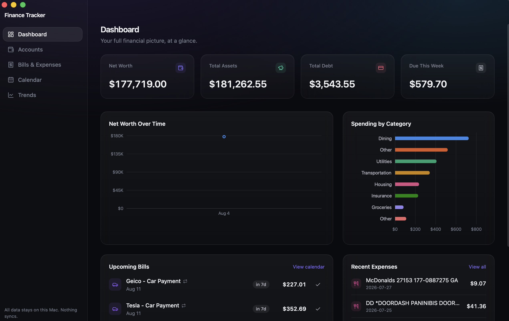
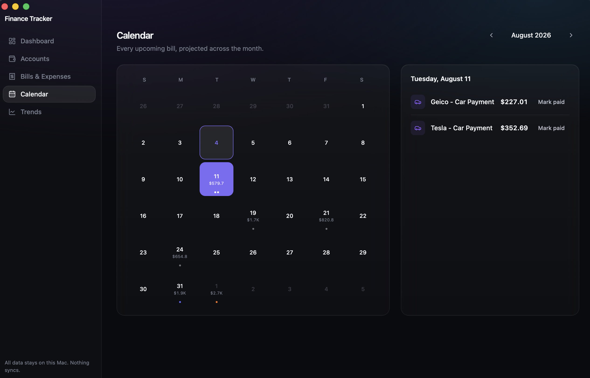
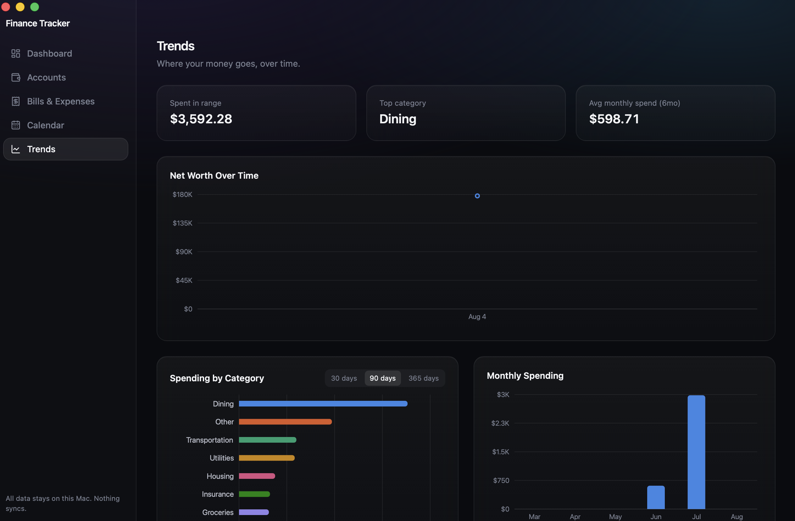

# Finance Tracker

A native macOS finance tracker for viewing account balances, tracking bills and
spending, and visualizing trends — without ever connecting to a real bank.

Built with [Tauri](https://tauri.app) (Rust) + React + TypeScript, with all
data stored locally in SQLite. Nothing syncs, nothing leaves the machine.

## Why

Most finance apps want you to link real bank credentials to a third-party
service (and pay lots of $$$). This one doesn't support that at all, by design — every balance is entered manually or imported from a statement CSV/PDF you download yourself. It trades live syncing for not having your account credentials or balances sitting in someone else's cloud.

## Screenshots

**Dashboard** — net worth, assets vs. debt, upcoming bills, spending by category



**Calendar** — every recurring bill projected across the month



**Trends** — net worth over time, category breakdown, monthly spending



## Features

- **Accounts** — track checking, HYSA/savings, brokerage, and credit card
  balances (Chase, Wealthfront, Fidelity, Robinhood, Capital One, BofA,
  Discover, or any institution you add). Balances are updated manually and
  every update is logged to a history table, which is what powers the net
  worth trend chart.
- **Bills & Expenses** — recurring bills (mortgage, insurance, utilities, lawn
  care, etc.) with due dates, recurrence, autopay flag, and a
  notify-me-N-days-before setting; one-off expenses; bulk import from a CSV or
  PDF statement.
- **Calendar** — recurring bills projected forward across the month, click a
  day to see what's due and mark it paid.
- **Trends** — net worth over time, spending by category (top 7 + "Other",
  with a 30/90/365-day range toggle), and monthly spending.
- **Native notifications** — a background check fires a macOS notification
  when a bill is due within its configured notice window.
- **CSV / PDF statement import** — point it at a bank/card CSV export, or a
  PDF statement if that's all your institution offers; it extracts
  transactions for you to review (and drop any stray lines) before importing.

## Import formats

The CSV importer looks for date/description/amount columns under common
header names (`Date`/`Transaction Date`, `Description`/`Memo`/`Payee`,
`Amount`/`Debit`) and should work with most bank exports unmodified.

PDF import is best-effort: it extracts text and scans for lines shaped like
`<date> <description> <amount>`. Statement layouts vary a lot between
institutions, so always review the parsed preview (and remove anything that
isn't really a transaction, like a subtotal or interest line) before
confirming the import.

Every import batch applies one category/account to all its rows — for
per-transaction categorization, categorize manually after import or edit the
CSV's category column before importing.

## Tech stack

- [Tauri 2](https://tauri.app) (Rust) — native shell, window management, OS
  notifications, filesystem access
- React 19 + TypeScript, [Vite](https://vitejs.dev)
- [Tailwind CSS 4](https://tailwindcss.com) + [Framer Motion](https://www.framer.com/motion/) for the UI
- [Zustand](https://zustand-demo.pmnd.rs/) for app state
- [Recharts](https://recharts.org/) for charts
- [`@tauri-apps/plugin-sql`](https://v2.tauri.app/plugin/sql/) (SQLite) for local storage — schema and seed
  data live in `src-tauri/migrations/`
- [`pdfjs-dist`](https://mozilla.github.io/pdf.js/) for PDF statement text extraction

## Development

Prerequisites: [Node.js](https://nodejs.org), [Rust](https://www.rust-lang.org/tools/install), and Xcode Command Line Tools.

```bash
npm install
npm run tauri dev    # launch in development mode
```

## Building

```bash
npm run tauri build
```

Produces a `.app` and `.dmg` under `src-tauri/target/release/bundle/`. The
build isn't code-signed/notarized, so macOS Gatekeeper will flag it on first
launch — right-click the app → Open to bypass that once.

## Data storage

The SQLite database lives at
`~/Library/Application Support/com.bharathjyothi.financetracker/finance-tracker.db`.
There is no sync, no server, and no telemetry — it's a plain local file you
can back up, inspect, or delete like any other file on your Mac.
